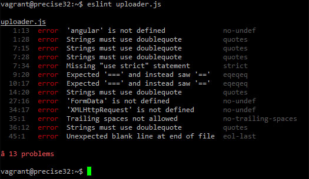

## What are Coding Standards
Coding standards don't contribute any functionality to your program. No matter how you write your code as long as your syntax is correct, the computer will munch it up into a bunch of 1s and 0s. Coding standards is meant for people not the computer. You can think of coding standards as the formatting of a text document. You can change the font, font size, bold, italicize, and many more things, but the message of your text remains the same. The same can be said for coding. You could write your entire Java program on one incredibly long line and the compiler will be happy and the program will run fine, but when you or someone else has to go back and fix a bug or add functionality, it will be very painful to decipher a program smooshed into a long single line. The point of coding standards is to make it easy for people, including the person who wrote the code, to read and understand.

## ESlint
ESlint is a code analysis tool that can find problems with your formatting based on your desired configuration. Starting off using ESlint will suck because nothing is more annoying than finishing up your program only to have to go back and add a space here, a comma there, an indentation value of 2 over there, and we can't forget a missing line at the end of your program, but after addressing all the complaints ESlint has about your poorly formatted code the ESlint overlords deem your code acceptable and grant it a green checkmark. As a bonus you get very readable code. Fortunately, after programming under the pressure of ESlint, eventually, your old coding habits will break, and you will be able to naturally output ESlint compliant code.

## Conclusion
I kind of went off the rails comparing ESlint to a totalitarian dictator, but main point I am trying to make is that following a coding standard might be annoying to get used to in the beginning, but eventually it will feel natural to code to a standard like ESlint. And once your code follows a coding standard, it will be so much easier for other people to understand what you wrote. 
