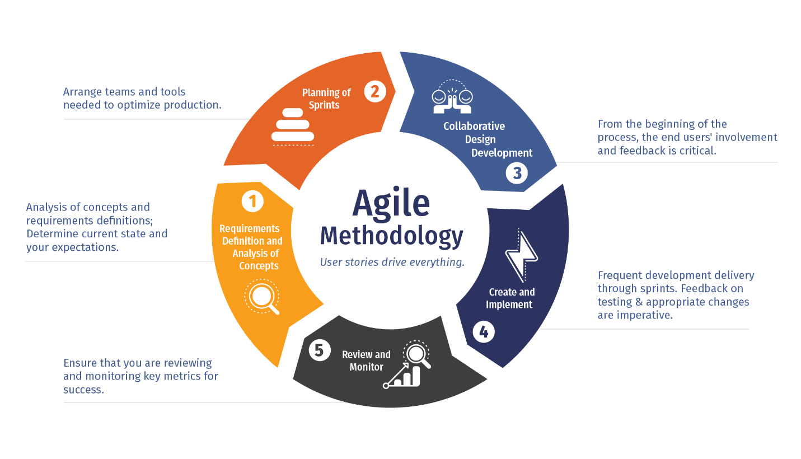

## Software engineering is more than just programming
On the surface software engineering just seems like typing a collection of characters on a computer that eventually comes together and takes the form of a functional program, but that only scratches the surface of the software engineering iceberg. Behind the scenes, there are many other aspects of software engineering that is required to make a good program. If this program is large enough that it requires the cooperation of multiple people, it becomes even more complex to coordinate many people working on the same thing. This essay will attempt to shine some light on high level things that are required to successfully engineer a piece of software. These being coding standards and agile project management.

### Coding Standards
It is true that every piece of software can be boiled down to an annoyingly long string of ones and zeroes or an entire program all on one line with a semicolons sprinkled throughout. Even though it may get the job done and functions as intended, but if you or anyone else has to go back to add some features or fix a bug it will be pure pain and suffering trying to decipher a single line of code. Fortunately Coding Standards can help make code more efficient and more readable and by extension easier to maintain and work with. A very common coding standard is DRY which is an acronym for "Don't repeat yourself". Essentially, if there is a block of code being used in multiple places, putting that block of code into a function and using that function instead will turn a block of code into a single line, increasing readability. Coding standards don't directly affect teh functionality of your program, but it offers good guidelines to make code easier to read and maintain.

### Agile Project Management
Agile project management is a methodology of project management. It is often used with software development. It works by iteratively adding features and functions to your project and making it available for feedback very quickly. This has the advantages of getting feedback for the feature quickly and it makes finding bugs that may have come with the implementation of that feature easier because only a single feature was added, so it is easier to focus in on that area and see what may be causing bugs. It also makes it easier to change the course the project will take because you are receiving updates on it so frequently compared to the traditional route of creating the entire project before getting user input. Agile project management is very good methodology to quickly develop a piece of software.

## Conclusion
I only have experience working with the above techniques in respect to web development, but it can be applied to any project that involves software development. Interestingly, none of the things mentioned above actually involve any programming. They are still very important because without them, software development would be a genuine pain to do. Fortunately, there is tons of information out there that can help smooth the software development process for any project. Getting started into the world of software development can be daunting, but if you employ good practices, it can be very rewarding.  
